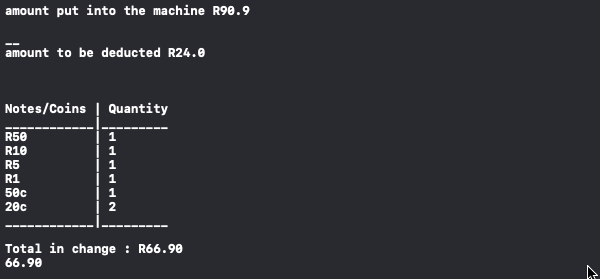

# ParkingMachine

***Please use XCode to run this Playground***

## Rand Denominations
#### Coins are issued in 5c, 10c, 20c, 50c, R 1, R 2, and R 5 denominations. Banknotes include R 10, R 20, R 50, R 100, R 200 [denominations.](https://www1.oanda.com/currency/iso-currency-codes/ZAR),
for more about the rand checkout <https://www1.oanda.com/currency/iso-currency-codes/ZAR>

## Main function required
### 
```swift
pay(amountPaying: Double, amountToDeduct: Double) -> String 
{ ... }
```

- Parameter 1 as  ``` amountpaying```
- Parameter 2 as ``` amountToDeduct```
- function takes parameters as shown on Rand Denomination except withought the symbols, and with or without decimals when required, from 0 rands .. eg:
```swift
pay(amountPaying: 90.90, amountToDeduct: 24)
```




## Additional functions
### getQuantity
```swift
func getQuantity(change: Int, totalCentsInChange: Int) -> Int 
{ ... }
``` 
- returns number/quantity of Note/Coin in change
- eliminates repetions when as used in the for loop

### changeLeft
```swift
func changeLeft(change: Int, totalCentsInChange: Int) -> Int
{ ... }
```

- returns the change remaining

### Unit Testing

- change '''runTest = false''' on line 8 to true to enanble  Unit testing

